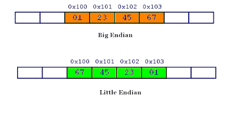

<table>
    <thead>
        <td>
            <a href="./00. Introduction.md"><< Previous Chapter</a>
        </td>
        <td>
            1/5?
        </td>
        <td>
            <a href="./02. Assembly.md">Next Chapter >></a>
        </td>
    </thead>
</table>

<h1>
  Chapter 1
  Storage
</h1>

In a RISC-V system, the main memory is byte-addressable. We represent it by displaying ranges of bytes in hexadecimal and their corresponding <a href="./XX. Others.md">ASCII characters</a>.

## 1.1 Big-Endian & Little-Endian
Endianness is the selection of which end of a multi-byte value is to be placed at the lowest byte address.

## 1.2 Array
An array is a data structure consisting of an ordered set of elements, all of which are of the same type. Here, "type" refers to the size (number of bytes) and representation (signed, unsigned, etc.) of each element.
## 1.3 Context of data
Interpreting data values can vary significantly based on their context of use. Assuming the purpose of a set of bytes solely based on their contents can be highly misleading. For instance, consider the byte data 0x76. Depending on the interpretation:
- If viewed as an ASCII character, it represents 'v'.
- As an integer value, it equals 118.
- In the context of a conditional, it may represent logic TRUE.