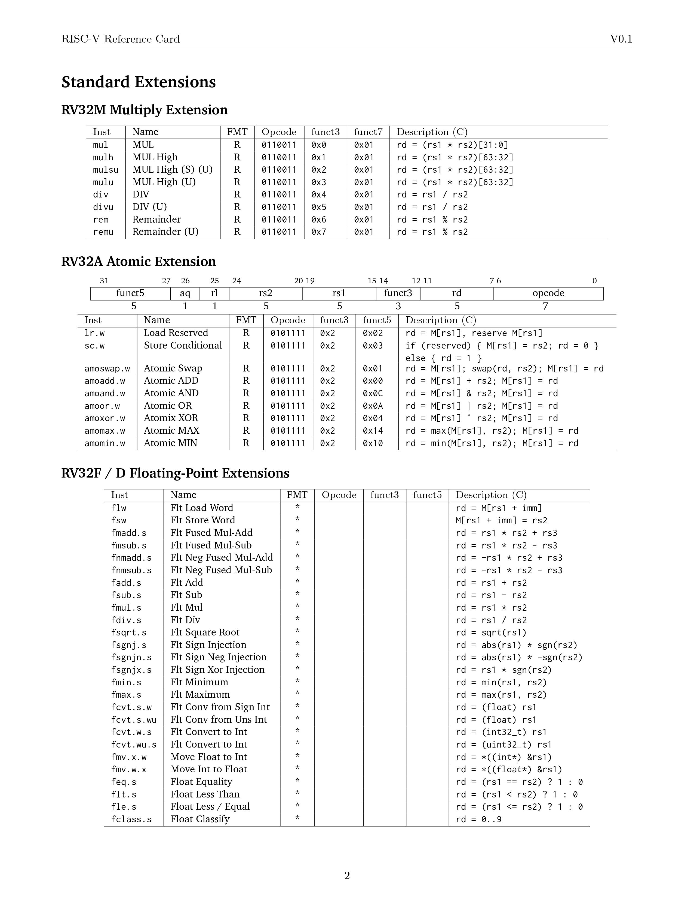
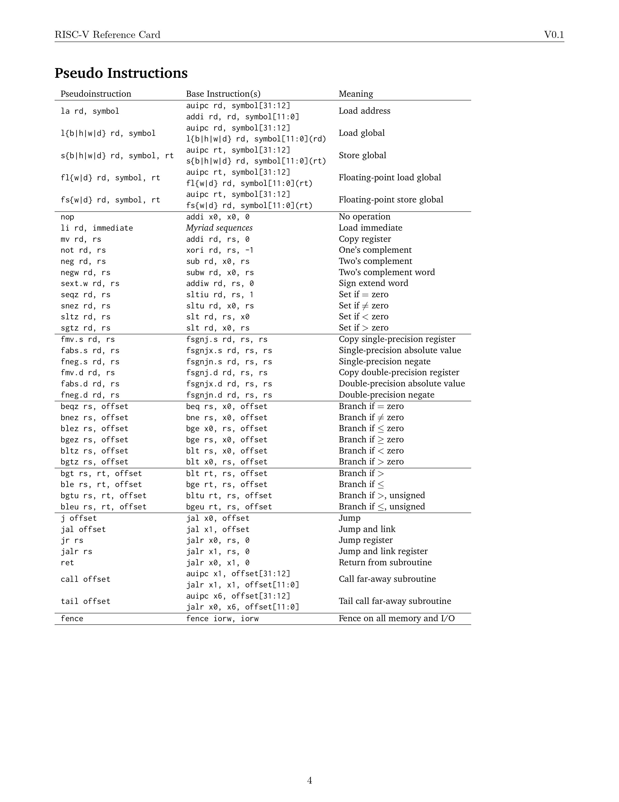
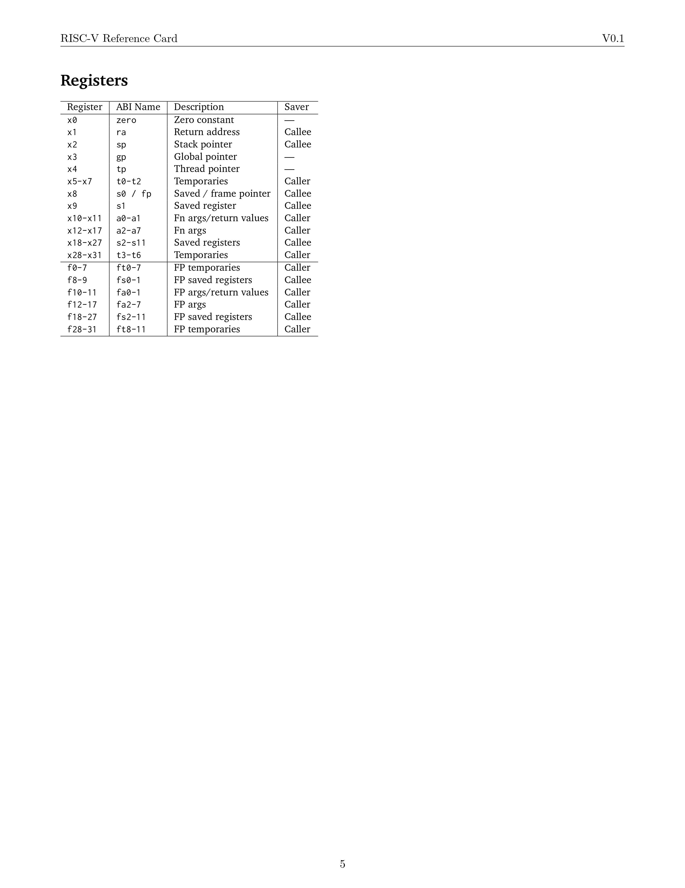
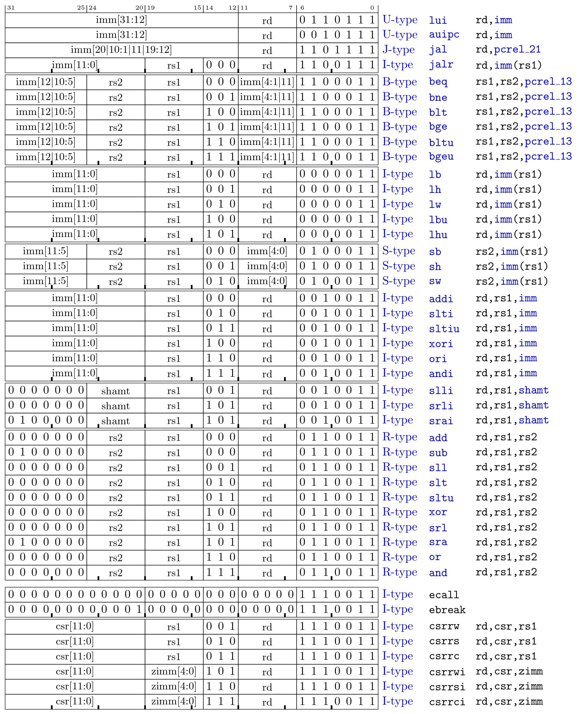
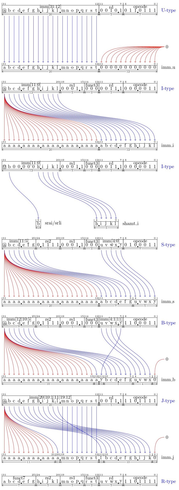

<table>
    <thead>
        <td>
            <a href="./01. Storage.md"><< Previous Chapter</a>
        </td>
        <td>
            2/5?
        </td>
        <td>
            <a href="">Next Chapter >></a>
        </td>
    </thead>
</table>

<h1>
  Chapter 2
  Assembly
</h1>

## 2.1 Conventions and Terminology
- XLEN: bit-length of an x register in the machine architecture. EX in RV32 are 32, 64, 128.
- sx(val): sign extend val to the left by repearting the sign bit. EX: sx(0x8a) --> 0xff8a
- zx(val): zero extend val to the left by repearting 0. EX: zx(0x8a) --> 0x008a
- zr(val): zero extend val to the right by repeating 0. EX: zr(0x8a) --> 0x8a00
- mx(addr): x bit data (little-endian) in memory starting at address addr. EX: m8(addr) <- source, dest <- m16(addr)
- +offset/-offset: offset the address of current instruction
- pcrel_13: an address within [-4096; 4094] or [-0x1000; 0x0ffe] of current instruction address.
- pcrel_21: an address within [-1048576; 1048574] or [-0x100000; 0x0ffffe] of current instruction address.
- pc: current value of program counter.
- rd: register destination
- rs1, rs2: register source
- imm: immediate numberic operand, the data stored within instruction.
- rsN[h:l]: h to l bit of register N. EX: rs1[15:3]
## 2.2 Adressing Mode
- Immediate Addressing Mode: Operand is directly specified within the instruction.
- Register Addressing Mode: Operand is specified by referencing a register.
- Base-Displacement Addressing Mode: Offset added to a base address to access operand.
- PC-Relative Addressing Mode: Addresses memory relative to the program counter (PC).
## 2.3 Instruction Encode
RISC-V, an open standard instruction set architecture (ISA), features several instruction formats.

These formats are designed to accommodate various types of instructions and operand types efficiently.

### 2.3.1 U Type (Upper Immediate Type)
Used for immediate values that require more bits than I-Type.

Consists of opcode, destination register operand (rd), and immediate value (imm).

The U-Type format is used for instructions that use a 20-bit immediate operand and an rd destination register.

An x register number that must be set to a value determined by the instruction is contained in the rd field.

EX: lui x23, 0x12345 will result in setting x23 register to the value 0x12345000.

### 2.3.2 J Type (Jump Type)
Used for unconditional jumps and function calls.

Consists of opcode, destination register operand (rd), jump target (imm), and function code (funct3).

### 2.3.3 R Type (Register Type)
Used for arithmetic, logical, and shift operations.

Consists of opcode, source register operands (rs1 and rs2), destination register operand (rd), function code (funct3 and funct7).

### 2.3.4 I Type (Immediate Type)
The I-type instruction format is used to encode instructions with a signed 12-bit immediate operand with a range of [−2048..2047], an rd register, and an rs1 register.

A special case of the I-type is used for shift-immediate instructions where the imm field is used to represent the number of bit positions to shift.

### 2.3.5 S Type (Store Type)
Used for storing data into memory.

Consists of opcode, base register operand (rs1), source register operand (rs2), store offset (imm), and function code (funct3).

### 2.3.6 B Type (Branch Type)
Used for conditional branching.

Consists of opcode, two source register operands (rs1 and rs2), branch offset (imm), and function code (funct3).

## 2.4 References

# 2.5 Summary

